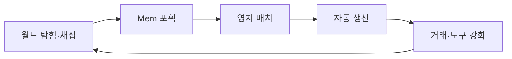
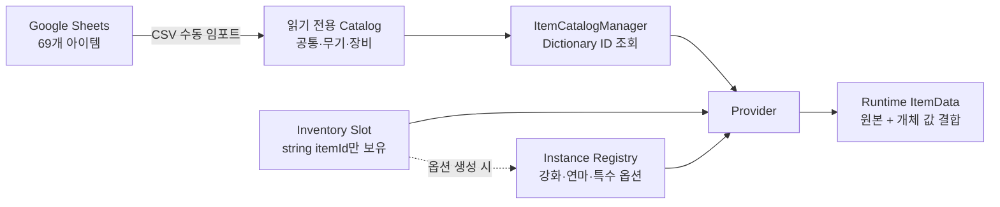

<div align="center">

# MemTown

**탐험에서 포획한 Mem을 영지의 생산과 성장으로 연결하는 생활·탐험 어드벤처**


[플레이 영상](https://youtu.be/8U2FVI8F8jM) · [포트폴리오](https://hwang-doyeon-game-dev.hwangdy135.chatgpt.site/) · [상세 기술 문서](https://app.notion.com/p/ea8f1fce5d168368826401037747cbaf) · [GitHub](https://github.com/doyeon-SM/Mememememem)

</div>

> 5인 팀의 팀장으로서 전체 기획과 시스템·데이터 구조, 일정 및 MVP 범위를 설계하고 QA를 진행했습니다. 8주 동안 1개 지역의 탐험·포획·영지 생산 루프를 완성했습니다.
>
> **기여 범위 안내:** 직접 작성한 코드는 없습니다. 요구사항·데이터 소유권·예외 조건을 정의하고, AI가 생성한 코드 초안을 Unity에 적용해 기능·데이터 흐름·플레이를 테스트한 뒤 수정 방향을 결정했습니다.

## 플레이 이미지

| 월드 탐험 | Mem 포획 |
| --- | --- |
|  |  |

| 상점과 거래 | 영지와 시설 관리 |
| --- | --- |
|  |  |

## 프로젝트 개요

| 구분 | 내용 |
| --- | --- |
| 개발 기간 | 2026.06.29–2026.08.19 · 8주 |
| 개발 형태 | 5인 팀 · 팀장 |
| 담당 | 전체 기획, 시스템·데이터 구조 설계, AI 생성 코드 검증·개선 지시, QA, 일정·범위 관리 |
| 장르 | 3D 생활·탐험 어드벤처 + 2.5D 방치형 타이쿤 |
| 플랫폼 | PC · Steam 출시 가능성 검토 중 |
| 기술 | Unity 6000.3.9f1 · C# · CSV · Google Sheets |
| AI 도구 | Claude Code · Unity MCP · Tripo AI · Codex |
| 결과 | 포획 가능한 Mem 43종과 1개 지역의 탐험·포획·영지 생산 루프를 갖춘 MVP |

## MVP와 코어 루프



탐험에서 얻은 Mem이 영지의 생산성과 다음 성장으로 이어지도록 설계했습니다. 8주 MVP에서는 월드와 영지 이동, 포획, 자동 생산, 상점, 도구 강화를 하나의 반복 가능한 흐름으로 연결했습니다.

## 나의 역할과 팀 경계

### 직접 담당한 의사결정

- 핵심 루프와 전체 기획, 기능 우선순위 및 8주 MVP 범위 결정
- 아이템 ID 규칙, 원본·개체·Provider의 책임과 데이터 소유권 설계
- 상점·대장간·원정 시스템의 요구사항, 데이터 구조, 예외 조건 정의
- AI 생성 코드 초안을 Unity에 적용하고 기능·데이터 흐름·플레이 테스트 수행
- 테스트 결과에 따라 책임 구조와 수정 요구사항을 다시 정의하고 팀에 공유
- 정기 회의, 일일 TODO, 담당 조정, 내부 테스트와 QA 진행

### 명확히 구분하는 범위

- **직접 작성한 코드는 없습니다.** 코드 생성에는 AI를 사용했습니다.
- 실제 **저장 시스템 구현은 담당 팀원**이 수행했습니다. 저는 저장 대상이 되는 원본·개체 데이터의 경계와 런타임 결합 규칙을 설계했습니다.
- UI와 월드 디테일은 해당 역량을 가진 팀원에게 결정 권한을 확대하고, 기획 기준과 일정 관리를 지원했습니다.

## 아이템 데이터 구조

초기에는 약 20개의 테스트 아이템을 개별 ScriptableObject로 관리했습니다. 아이템 수가 늘자 대량 추가, 검색·정렬, 경제 밸런스의 일괄 수정 비용이 커졌습니다. 이에 69개 아이템을 Google Sheets와 CSV로 관리하고, 런타임에서는 ID를 기준으로 조회·결합하는 구조를 설계했습니다.



- **원본 데이터:** 이름, 아이콘, 기본 수치처럼 공유되는 값을 읽기 전용 Catalog에서 관리합니다.
- **개체 데이터:** 강화 레벨, 연마 옵션, 특수 옵션만 Registry에 저장합니다.
- **브릿지:** Provider가 원본과 개체 값을 결합해 런타임 `ItemData`를 재생성합니다.
- 인벤토리 슬롯은 문자열 `itemId`만 보유합니다. 옵션이 생긴 아이템만 `@`가 포함된 합성 ID 개체를 지연 생성합니다.
- 중복 ID는 등록하지 않고, 누락되거나 잘못된 값은 화면 표시와 로그로 확인하도록 요구사항을 정의했습니다.

## 문제 해결: 개별 SO에서 카탈로그 구조로

| 단계 | 내용 |
| --- | --- |
| 문제 | 테스트 아이템 약 20개를 개별 ScriptableObject로 관리해 데이터가 늘수록 검색·정렬·대량 수정 비용이 커졌습니다. |
| 판단 | 기획자가 한 화면에서 편집할 수 있는 Sheets·CSV를 원본으로 삼고, Dictionary 기반 ID 조회와 원본·개체·Provider 3계층을 데이터 참조 표준으로 정했습니다. |
| 적용 | 요구사항과 예외 조건을 먼저 정의한 뒤 AI가 생성한 구현 초안을 Unity에 적용했습니다. 확장에 불리한 결과는 단순 수정이 아니라 책임과 데이터 흐름부터 다시 설계해 변경을 지시했습니다. |
| 검증 | 69개 데이터의 임포트·ID 조회·런타임 결합을 기능 테스트하고, 중복 ID 차단과 누락·오류 값의 표시 및 로그를 확인했습니다. |
| 결과 | 새 구조에서 대량 수정과 경제 밸런싱을 실제 30분 이내에 완료했습니다. |

> **수치 해석:** 기존 ScriptableObject 방식의 “1시간 이상”은 당시 작업량을 바탕으로 한 **예상치**입니다. 새 구조의 “30분 이내”만 실제 수행 결과이며, 통제된 전후 성능 측정으로 표현하지 않습니다.

## AI 활용과 검증 책임

```text
요구사항·소유권·예외 조건 정의
        ↓
Claude Code·Unity MCP로 코드 초안 생성
        ↓
Unity 적용 및 기능·데이터 흐름·플레이 테스트
        ↓
문제 재현과 원인 범위 확인
        ↓
책임 구조·데이터 흐름 재설계 및 수정 지시
        ↓
재검증
```

코드 생성 자체가 아니라, **무엇을 구현해야 하는지와 데이터가 어디에 속해야 하는지를 정의하고 결과를 검증하는 역할**을 맡았습니다. 예를 들어 무기가 전투 수치를 직접 소유하던 초안은 확장에 불리하다고 판단해, 무기는 스킬 ID만 보유하고 실제 수치는 스킬이 관리하도록 책임을 다시 나눈 뒤 변경 결과를 확인했습니다.

## 팀 운영과 플레이 검증

- 매주 화요일·목요일 정기 회의와 매일 아침 TODO 보고로 진행 상황을 확인했습니다.
- 월드 디테일 일정이 지연되자 개인 면담 후 디자인 담당을 재조정했습니다. 기존 담당자는 월드 오브젝트 구현과 상호작용 보완을 이어가도록 해 역할 단절을 줄였습니다.
- 재조정 결과 5주차에 월드 디테일을 마치고, 6주차 월드 테스트·튜토리얼·SkyBox 작업 기간을 확보했습니다.
- 약 10명의 내부 테스트를 통해 초반 피드백이 늦고 Mem별 생산 효율이 직관적으로 전달되지 않는 문제를 확인했습니다.
- 튜토리얼 테스트 시나리오에서 3분 안에 핵심 순환을 확인했습니다. 실제 내부 플레이에서는 평균 5분 이내에 영지로 이동해 첫 생산을 시작했습니다.

## 완성 범위와 한계

### 8주 MVP에 포함

- 1개 지역의 탐험·채집·Mem 포획
- 포획한 Mem의 영지 배치와 자동 생산
- 월드↔영지 이동, 상점, 도구 강화
- 포획 가능한 Mem 43종

### MVP에서 제외

- 스킬, 무기, 방어구, 장신구, 퀘스트 등 RPG 확장 요소
- 추가 지역과 해당 지역의 보스전
- Steam 정식 출시

RPG 요소는 완성도와 검증 범위를 고려해 MVP에서 제외했습니다. 관련 구조는 개발 브랜치에서 보완 중이며, 후속 확장과 출시 가능성을 검토하고 있습니다.

## 실행 및 빌드 참고

```bash
git clone https://github.com/doyeon-SM/Mememememem.git
```

1. Unity Hub에서 저장소 폴더를 추가합니다.
2. 개발에 사용한 **Unity 6000.3.9f1**로 프로젝트를 엽니다.
3. 패키지 임포트가 끝난 뒤 프로젝트의 Build Settings에 등록된 씬과 의존성을 확인합니다.
4. PC 환경을 기준으로 플레이하거나 빌드합니다.

저장소에는 대용량 Unity 에셋과 여러 작업용 씬이 포함되어 있어 최초 임포트에 시간이 걸릴 수 있습니다. 채용 검토 시에는 위 플레이 영상과 상세 기술 문서를 함께 확인해 주세요.

## Links

- [플레이 영상](https://youtu.be/8U2FVI8F8jM)
- [게임 개발자 포트폴리오](https://hwang-doyeon-game-dev.hwangdy135.chatgpt.site/)
- [MemTown 상세 기술 문서](https://app.notion.com/p/ea8f1fce5d168368826401037747cbaf)
- [GitHub 저장소](https://github.com/doyeon-SM/Mememememem)
